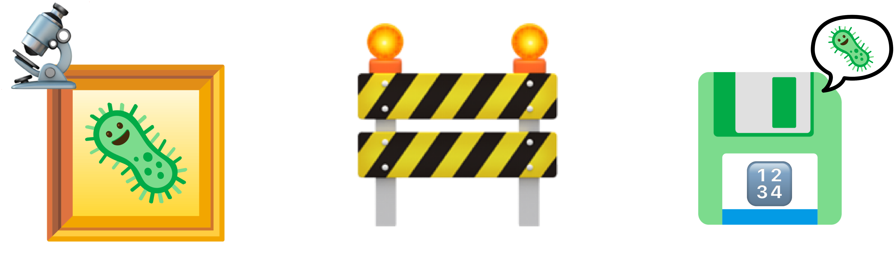
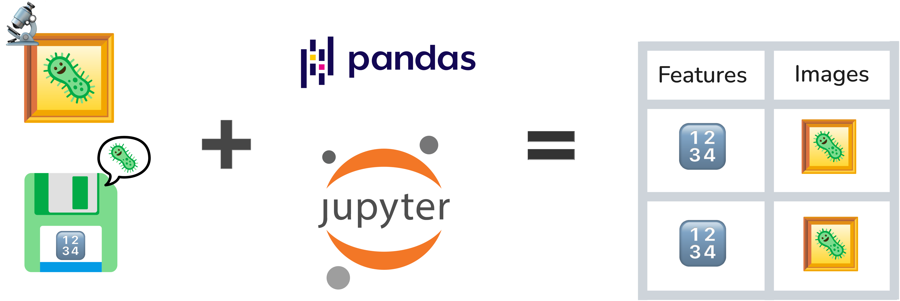
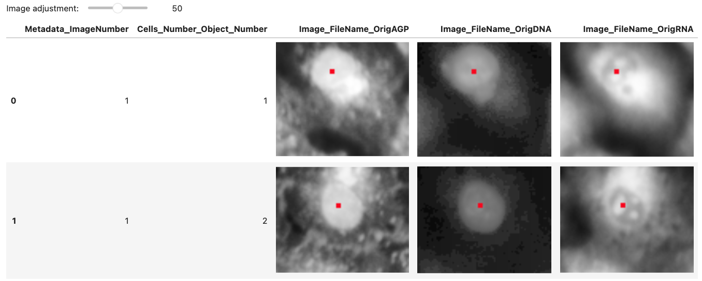
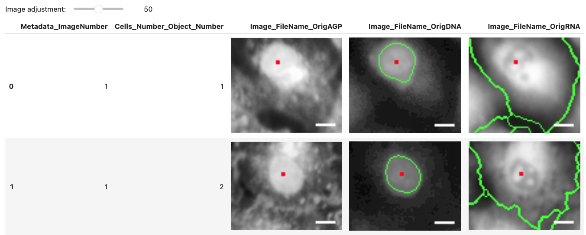
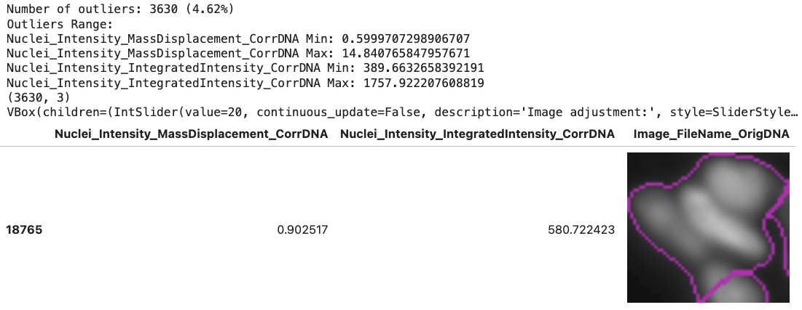

## Why separate profiles and images?

{width=100% fig-align="center"}

High-content screens produce **millions of rows of features** and **many
images**.
Jumping between a DataFrame and an image viewer slows exploration and hides issues like segmentation or image errors.
**CytoDataFrame** puts an **image thumbnail** right next to the row's features so you can **see** how features relate to images.

## CytoDataFrame for integrated analysis

{width=100% fig-align="center"}

**CytoDataFrame** is a small package built on top of `pandas.DataFrame` that embeds **inline images** (cells, nuclei, or other compartments) alongside per-object features within **Jupyter** notebook interfaces.
Using CytoDataFrame enables you to:

- **Keep context at a glance** - Each row shows the features *and* the object.
- **Filter and explore** - Subset outliers, phenotypes, or QC flags and see
  what they look like immediately.
- **Stay in your workflow** - It behaves like a DataFrame; your plotting,
  modeling, and exports still work.
- **Fantastic for integrations** - Tight integration with packages such as **coSMicQC** returns CytoDataFrames so you can act on QC signals with visuals.

## Using CytoDataFrame in Python

### Install

```bash
# install CytoDataFrame from PyPI
pip install cytodataframe
```

### View images with your profiles

```python
from cytodataframe import CytoDataFrame

# Load features and images together.
CytoDataFrame(
    data="BR00117006.parquet",
    data_context_dir="images/orig",
)[[
        "Metadata_ImageNumber",
        "Cells_Number_Object_Number",
        "Image_FileName_OrigAGP",
        "Image_FileName_OrigDNA",
        "Image_FileName_OrigRNA",
  ]]
```



### Show segmented objects with profiles

```python
# load outlines to show segmented images
CytoDataFrame(
    data="BR00117006.parquet",
    data_context_dir="images/orig",
    data_outline_context_dir=f"images/outlines",
)[[
        "Metadata_ImageNumber",
        "Cells_Number_Object_Number",
        "Image_FileName_OrigAGP",
        "Image_FileName_OrigDNA",
        "Image_FileName_OrigRNA",
  ]]
```


### Change display configuration for images

```python
# change the color of your outlines (and more!)
CytoDataFrame(
    data="BR00117006.parquet",
    data_context_dir="images/orig",
    data_outline_context_dir=f"images/outlines",
    display_options={
      "outline_color": (200, 100, 255)
    },
)[[
        "Metadata_ImageNumber",
        "Cells_Number_Object_Number",
        "Image_FileName_OrigAGP",
        "Image_FileName_OrigDNA",
        "Image_FileName_OrigRNA",
  ]]
```


### Add scale bars for objects

```python
# add scale bars using reproducible configuration
CytoDataFrame(
    data="BR00117006.parquet",
    data_context_dir="images/orig",
    data_outline_context_dir=f"images/outlines",
    display_options={
        "pixel_per_um": 0.1550,
        "scale_bar": {"length_um": 100,
            "location": "lower right",
            "color": (255, 255, 255),
            "thickness_px": 2, "margin_px": 5,},
    },
)[[
        "Metadata_ImageNumber",
        "Cells_Number_Object_Number",
        "Image_FileName_OrigAGP",
        "Image_FileName_OrigDNA",
        "Image_FileName_OrigRNA",
  ]]
```



## coSMicQC leverages CytoDataFrames


```python
import cosmicqc

# find and label outliers for single-cell data
find_outliers(
    df=CytoDataFrame(
      data="single-cell-profiles.parquet,
      data_context_dir="images/orig",
      data_outline_context_dir=f"images/outlines",
      display_options={"center_dot": False,
"outline_color": (180, 30, 180), "brightness": 20,
    },
  ),
    metadata_columns=metadata_columns,
    feature_thresholds={
"Nuclei_Intensity_MassDisplacement_CorrDNA": 0.05,
"Nuclei_Intensity_IntegratedIntensity_CorrDNA": 1.5,
    },
)[[
"Nuclei_Intensity_MassDisplacement_CorrDNA",
"Nuclei_Intensity_IntegratedIntensity_CorrDNA",
"Image_FileName_OrigDNA",
  ]]
```



_coSMicQC functions can return CytoDataFrames, letting you pair quality control flags with images to make immediate, visual decisions and improve your profiling outcomes._

## Acknowledgements

We thank those who have inspired, contributed, or helped support CytoDataFrame and the Cytomining Ecosystem:

- Open source science from the teams behind [__CellProfiler__](https://github.com/CellProfiler/CellProfiler)
- Members of the [__Way Lab__](https://www.waysciencelab.com/) at the University of Colorado Anschutz Medical Campus
- [__Department of Biomedical Informatics__](https://medschool.cuanschutz.edu/dbmi) within the School of Medicine at the University of Colorado Anschutz Medical Campus
